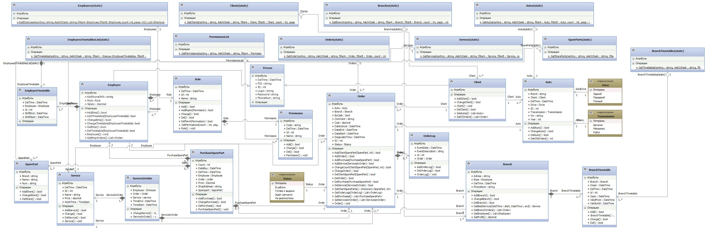
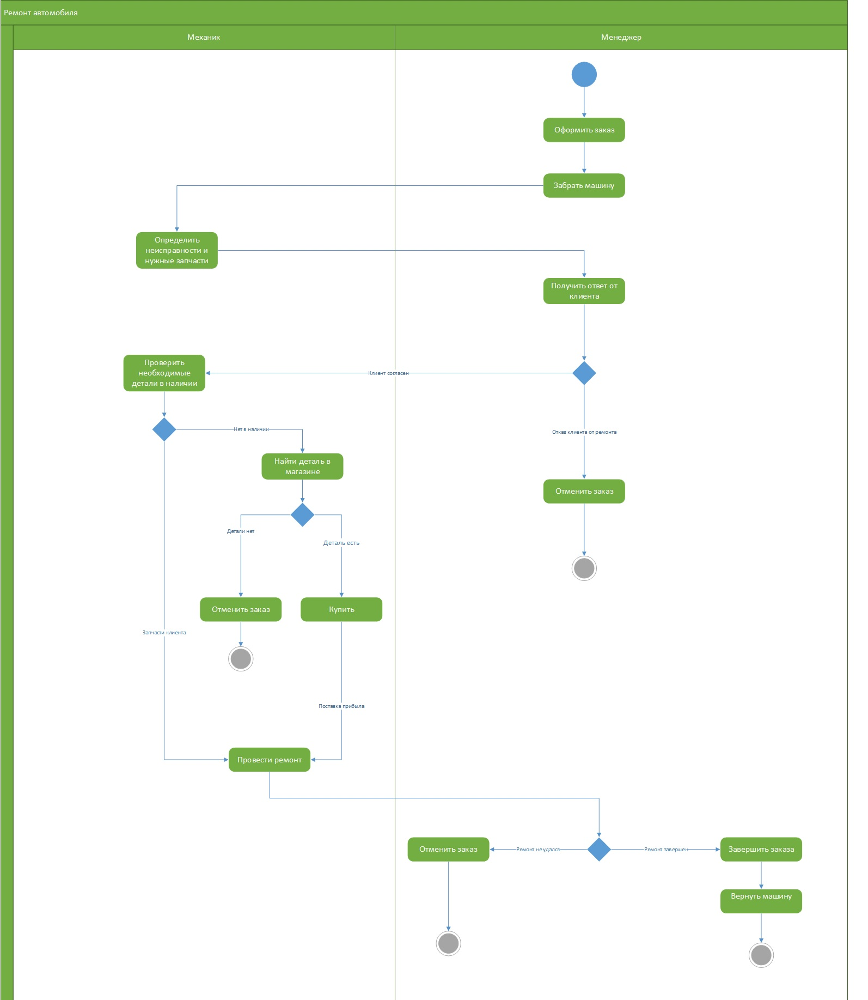
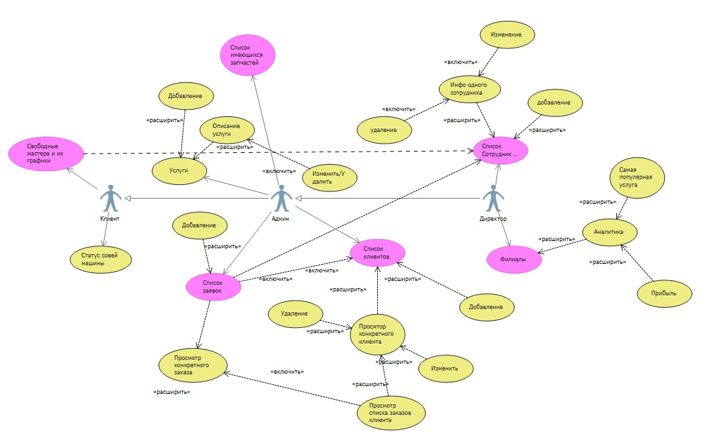
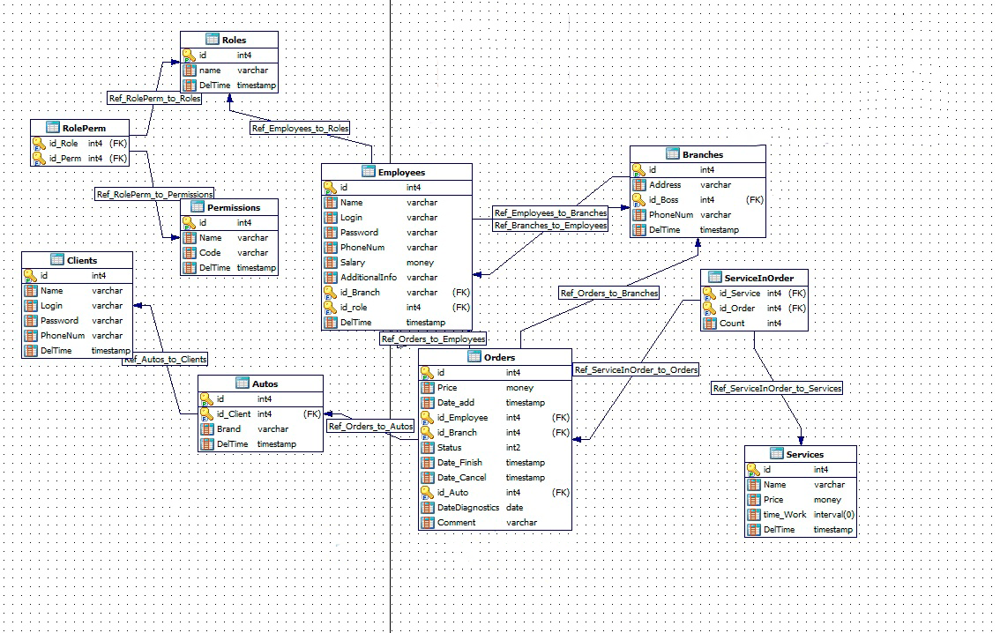

# Автосервис
## Описание миссии, задач разрабатываемого программного продукта:
Миссия программы - Автоматизация выполнения различных видов деятельности автосервиса для повышения эффективности работы сервиса и наблюдения за статистическими показателями для улучшения работы.
В ходе эксплуатации планируется решить следующие задачи:
-   Простое формирование новых заявок и редактирование существующих
-   Управление списком сотрудников, формирование персонального расписания
-   Управление списком оказываемых услуг
-   Отслеживание статуса заявки

## Диаграмма классов

### Список классов
-   Person - абстрактный класс, от него наследуются Client и Employee.
-   Client - класс, представляющий собой клиента сервиса.
-   Employee - класс, представляющий собой сотрудника сервиса.
-   Auto - класс, представляющий собой автомобиль.
-   EmployeeTimetable - класс, представляющий собой расписание сотрудника.
-   Role - класс, представляющий собой роль сотрудника. У каждой роли есть ряд прав (Permission).
-   Permission - класс, представляющий собой определенное действие в системе. С помощью этого класса вместе с Role регулируются права пользователей в системе.
-   Service - класс, представляющий собой оказываемую услугу.
-   Order - класс, представляющий собой заявку на ремонт.
-   ServiceInOrder - класс, связывающий услугу и заказ. С помощью него,  можно видеть какой механик оказывал опрерделенную услугу, в какие сроки.
-   SparePart - класс, представляющий собой описание запчасти клиента.
-   PurchaseSparePart - класс, представляющий собой запчасти, которые купил сам сервис.
-   Branch - класс, представляющий собой филиал автосервиса.
-   BranchTimetable - класс, представляющий собой расписание филиала.

## Диаграмма действий
### Выполнение заявки

## Диаграмма прецедентов

# 📊 Диаграмма прецедентов

Диаграмма отображает взаимодействие пользователей с системой автосервиса. Она показывает, какие действия доступны различным ролям.

---

## 👥 Акторы (Роли пользователей)

| Актор     | Доступные действия |
|-----------|--------------------|
| **Клиент** | - Просмотр свободных мастеров и их графика  
              - Просмотр статуса своей машины |
| **Админ**  | - Управление заявками (добавление, удаление, просмотр)  
              - Управление клиентами (просмотр, изменение, заказы)  
              - Работа с услугами и запчастями (добавление, описание, включение)  
              - Управление сотрудниками (добавление, изменение, удаление, просмотр) |
| **Директор** | - Просмотр филиалов  
                 - Работа с аналитикой (прибыль, популярные услуги)  
                 - Доступ к спискам сотрудников и клиентов |

---

## 🧾 Основные прецеденты

### 📦 Заявки
- Добавление заявки  
- Удаление заявки  
- Просмотр списка заявок  
- Просмотр конкретного заказа

### 👤 Клиенты
- Просмотр списка клиентов  
- Просмотр конкретного клиента  
- Изменение данных клиента  
- Просмотр заказов клиента

### 🛠 Услуги и запчасти
- Добавление услуги  
- Описание услуги  
- Включение услуги  
- Просмотр списка запчастей

### 👨‍🔧 Сотрудники
- Добавление сотрудника  
- Изменение сотрудника  
- Удаление сотрудника  
- Просмотр информации о сотруднике  
- Просмотр списка сотрудников

### 📈 Аналитика
- Просмотр прибыли  
- Самая популярная услуга

---

## 🗂 Обозначения

- 🟡 **Жёлтые овалы** — действия системы (прецеденты).
- 🟣 **Розовые овалы** — сущности или списки (например, заявки, клиенты).
- 👤 **Серые человечки** — акторы (пользователи системы: Клиент, Админ, Директор).

---

> 📌 Диаграмма позволяет визуально определить, какие функции доступны конкретной роли и как они взаимодействуют с объектами системы.

## ER-диаграмма

